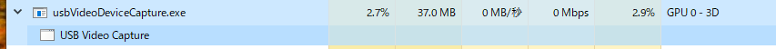
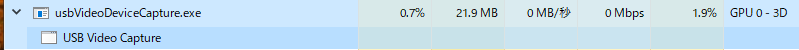
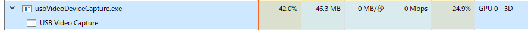
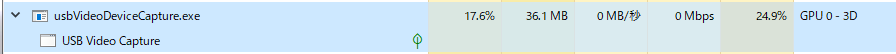
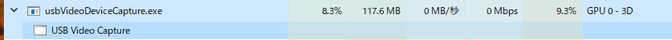
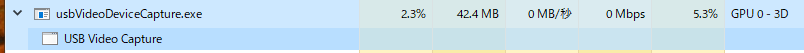
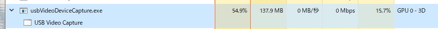
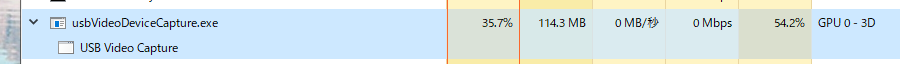

# usb video device capture

## Introduction

    Media Foundationを用いてキャプチャしたUSBキャプチャデバイス/USBカメラ(Webカメラ)からの映像を  
    DirectX11ベースのレンダラーにて描画するプログラムです。  

## Demo

## Performance

### Verification Machine Spec

#### No.1  

    OS  : Windows 10 Pro 22H2  
    CPU : Intel Core i9-7900X(10core, 20threads)  
    RAM : 24.0GB  
    GPU : NVIDIA GeForce RTX A4000(Driver ver.535.98)  

#### No.2  

    OS  : Windows 10 Pro 22H2  
    CPU : Intel Pentium N4200(4core, 4threads)  
    RAM : 4.0GB  
    GPU : Intel(R) HD Graphics 505  

### Verification USB Web camera

    Logicool HD Pro Webcam C920  
[LINK](https://www.logicool.co.jp/ja-jp/products/webcams/hd-pro-webcam-c920n.960-001261.html)

### Verification USB Video Capture Device

    I-O DATA GV-HUVC 4K  
[LINK](https://www.iodata.jp/product/av/capture/gv-huvc4k/index.htm)

### Result

| No. | Device Name                 | MAX Resolution | MAX FPS | Audio support |
|-----|-----------------------------|----------------|---------|---------------|
| 1   | Logicool HD Pro Webcam C920 | 2K(1920x1080)  | 30p     | Yes           |
| 2   | I-O DATA GV-HUVC 4K         | 4K(3840x2160)  | 30p     | Yes           |

#### Logicool HD Pro Webcam C920(Input : 2K30p, Output : 2K30p) <CPU, Memory, Disk, NW, GPU>

    - With No.1 PC(DMO)  

    - With No.1 PC(Pixel Shader)  

    - With No.2 PC(DMO)  

    - With No.2 PC(Pixel Shader)  

#### I-O DATA GV-HUVC 4K(Input : 4K30p, Output : 4K30p) <CPU, Memory, Disk, NW, GPU>

    - With No.1 PC(DMO)  

    - With No.1 PC(Pixel Shader)  

    - With No.2 PC(DMO)

    - With No.2 PC(Pixel Shader)  

## Build

    ex. For VS2017  
    powershell.exe cmake -S . -B build -G "\"Visual Studio 15 2017 Win64"\"  
    powershell.exe cmake --build build  

    ex. VS2019 or higher  
    powershell.exe cmake -S . -B build  
    powershell.exe cmake --build build  

## How to use

    1. Run the usbVideoDeviceCapture.exe from console.  
    2. Select the video capture device number.  
    3. Select the audio capture device number.  
    4. Select the audio output device number.  
    5. Select the color conversion mode number.  
    6. A window will appear and capture will begin.  

## Note

    - If all settings good, but capture is not started, the active signal resolution is not right.  
      Please check your windows display settings.  
      for example...  

## Supported color format

### Color Converter DSP(DirectX Media Object)

Please check to below url.  
[https://learn.microsoft.com/ja-jp/windows/win32/medfound/colorconverter](https://learn.microsoft.com/ja-jp/windows/win32/medfound/colorconverter)  

### Pixel Shader

| No. | Color format |
|-----|--------------|
| 1   | NV12         |
| 2   | RGB32        |

## Design

